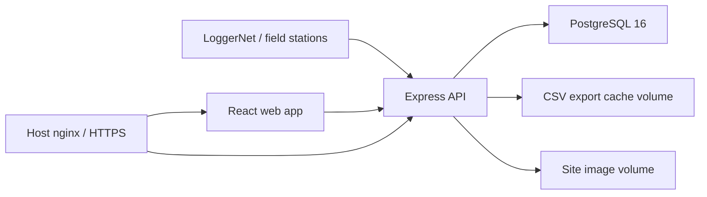

# SAEON Observations Monitor

The SAEON Observations Monitor is the public and technician-facing interface for LoggerNet weather and eddy covariance observations. It ingests raw LoggerNet data, maps technical server/table/field names into public site datasets, provides availability summaries, supports bounded downloads and JSON API access, and exposes technician workflows for mapping, site assets, backfills, and operational checks.

## What Is In This Repository

- `api/` - Express API, background sync jobs, public API routes, admin/mapping endpoints, CSV export generation, and image upload handling.
- `web/` - React frontend for Home, Data, Unified Mapping, Admin Panel, API Reference, Raw Data, Metadata Portal, Analytics, Issues, and About.
- `docker/` - PostgreSQL restore, optimization, status, backfill, and field-values partitioning scripts.
- `docker-compose.yml` - Local and production Docker stack for Postgres, API, and web.
- `DOCKER.md` - Docker deployment and restore notes.
- `FIELD_VALUES_PARTITIONING.md` - Runbook for the large `field_values` partition migration.

Generated exports, uploaded site images, database dumps, Docker volume archives, `node_modules`, and `.env` files are deliberately excluded from Git.

## Architecture



Default Docker ports are chosen so this stack can run beside older services during testing:

| Service | Container | Host port |
| --- | --- | --- |
| Web | `loggernet-web` | `3080` |
| API | `loggernet-api` | `3081` |
| Postgres | `loggernet-db` | `55432` |

## Local Setup

Create the Docker and API environment files from the examples, then fill in local or deployment secrets:

```bash
cp .env.example .env
cp api/.env.example api/.env
```

Install and build through Docker:

```bash
docker compose build
docker compose up -d
docker compose ps
```

Open the local web app at [http://localhost:3080](http://localhost:3080).

Useful smoke checks:

```bash
curl -i http://localhost:3080/
curl -s http://localhost:3081/api/public/site-status
curl -i http://localhost:3081/api/v1/sites
```

The `/api/v1/*` data API requires login. For local testing:

```bash
curl -c saeon-api.cookies \
  -H "Content-Type: application/json" \
  -d '{"username":"your-username","password":"your-password"}' \
  http://localhost:3081/api/login

curl -b saeon-api.cookies http://localhost:3081/api/v1/sites
```

Do not commit real passwords, OAuth client secrets, cookies, dumps, or Docker volume archives.

## Production Update Flow

On the server, keep the database and runtime data in Docker volumes. Keep the real `.env` and `api/.env` files on the server only. Pull code updates, rebuild the app containers, and leave the database volume intact:

```bash
cd /opt/saeon-observations-monitor-v2
git pull
docker compose build api web
docker compose up -d api web
docker compose ps
```

Check the app after each update:

```bash
curl -I http://localhost:3080/
curl -s http://localhost:3081/api/public/site-status
docker compose logs --tail=80 api
```

For the live domain from the server itself:

```bash
curl -k --resolve observationsmonitor.saeon.ac.za:443:127.0.0.1 \
  https://observationsmonitor.saeon.ac.za/api/public/site-status
```

## Background Jobs

The API runs the sync and export scheduler when `ENABLE_BACKGROUND_JOBS=true`.

- CSV exports: daily at 00:15 SAST.
- Fast writer sync: Monday to Saturday at 06:00, 14:00, and 22:00 SAST.
- Sunday fast sync: 06:00 and 14:00 SAST.
- Sunday extended sync: 20:00 SAST.

Check status after logging in:

```bash
curl -b saeon-api.cookies http://localhost:3081/api/background-status
```

Start a once-off writer run:

```bash
curl -b saeon-api.cookies -X POST http://localhost:3081/api/background/run-writer
```

Only one writer run should hold the advisory lock at a time.

## Database Notes

The production database uses a partitioned `public.field_values` table. Do not remove or recreate the database volume during normal deployments.

Quick health checks:

```bash
docker compose exec db psql -U postgres -d loggernet -c \
"select pg_size_pretty(pg_database_size('loggernet')) as db_size;"

docker compose exec db psql -U postgres -d loggernet -c \
"select count(*) as partitions from pg_inherits where inhparent = 'public.field_values'::regclass;"

docker compose exec db psql -U postgres -d loggernet -c \
"select sync_time, last_data_availability_sync_time from public.last_synced where id = 1;"
```

See `FIELD_VALUES_PARTITIONING.md` before attempting any field-values migration work.

## Public API

The API reference in the web app documents current endpoints and examples. Public metadata/status endpoints are available without login. Data listing, JSON data reads, and CSV downloads require a web session cookie or HTTP Basic Auth over HTTPS so usage can be rate-limited and recorded.

Example authenticated JSON data call:

```bash
curl -b saeon-api.cookies \
  "http://localhost:3081/api/v1/data?serverName=Benfontein%20AWS&tableName=5%20minute&startDate=2026-08-01&endDate=2026-08-02"
```

## Operational Safety

- Keep `api/.env` on the server only.
- Keep database dumps and physical volume archives under `/opt/backups`, not in the repository.
- Keep uploaded site images in the Docker image volume, not in Git.
- Do not run destructive volume commands unless there is a verified backup and a planned restore path.
- Test on `localhost:3080` and `localhost:3081` before switching nginx routes.
